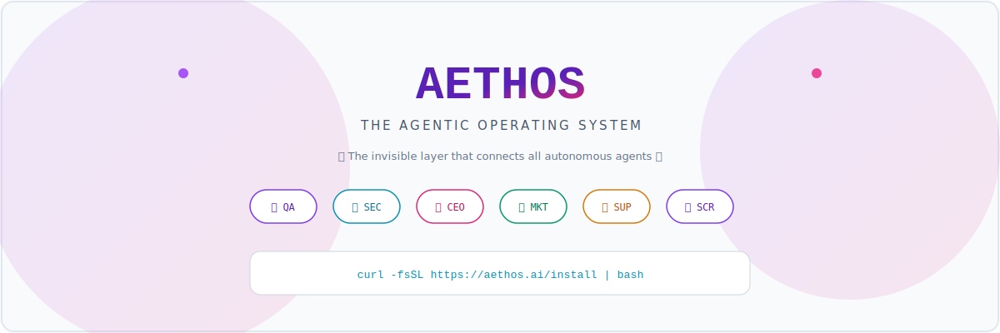

<p align="center">
  <picture>
    <source media="(prefers-color-scheme: dark)" srcset="github-banner-dark.svg">
    
  </picture>
</p>

<p align="center">
  <a href="https://github.com/pilotmain/aethos/blob/main/LICENSE">
    
  </a>
  <a href="https://github.com/pilotmain/aethos/blob/main/LICENSE.commercial">
    
  </a>
  <a href="https://github.com/pilotmain/aethos/stargazers">
    
  </a>
</p>

# AethOS — The Agentic Operating System

> **Repository:** [github.com/pilotmain/aethos](https://github.com/pilotmain/aethos)

## One-curl install

```bash
curl -fsSL https://raw.githubusercontent.com/pilotmain/aethos/main/install.sh | bash
```

With a **license string** for the wizard / runtime (optional):

```bash
curl -fsSL https://raw.githubusercontent.com/pilotmain/aethos/main/install.sh | bash -s -- --license 'YOUR_KEY'
```

Default clone/install path is often **`~/.aethos`**. From a **git clone** of this repo, use [docs/installation.md](docs/installation.md) instead.

## Quick start

```bash
cd ~/.aethos   # or your clone directory
source .venv/bin/activate
uvicorn app.main:app --reload --host 0.0.0.0 --port 8010
```

Open the web UI when you run the frontend (often [http://localhost:3000](http://localhost:3000)); API defaults vary — see [docs/WEB_UI.md](docs/WEB_UI.md) and [docs/SETUP.md](docs/SETUP.md).

## Features

- Natural-language **agents** and sub-agent workflows  
- **File** read/write and host-executor flows (policy-gated)  
- **Command** execution (allowlisted / supervised paths)  
- **Sandbox** plans with explicit approval and rollback  
- **Deploy** helpers (Vercel, Railway, …) when CLIs and tokens are configured  
- **Observability** and usage surfaces where enabled  

## Documentation

**Index:** [docs/README.md](docs/README.md) — installation, configuration, feature guides, architecture, and links to long-form docs (LLM, API, operations, dev jobs).

## Contributing

See [CONTRIBUTING.md](CONTRIBUTING.md).

## License

Dual-licensed:

- **Open source:** [Apache License 2.0](LICENSE)  
- **Commercial:** Pro / enterprise / support — [LICENSE.commercial](LICENSE.commercial)  

Contact: **[license@aethos.ai](mailto:license@aethos.ai)**
