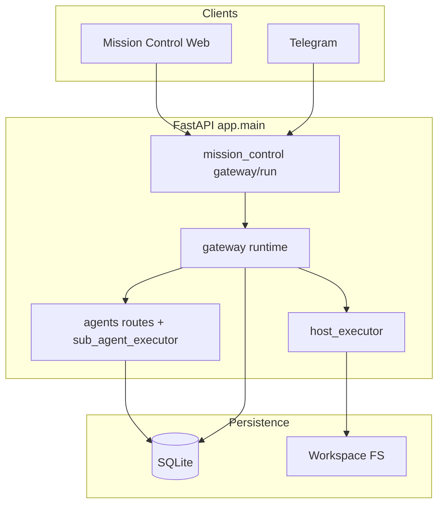

# AethOS — Software Design Document (SDD)

**Version:** 2.0  
**Date:** 2026-05-14  
**Status:** Draft — sections tagged `[Implemented]`, `[Target]`, or `[Release TBD]` per below.

> This document describes architecture and behavior aligned with the repository.  
> **`[Implemented]`** — verified against current modules (paths cited).  
> **`[Target]`** — agreed direction or product intent; confirm against code before treating as normative.  
> **`[Release TBD]`** — version-specific behavior to be filled when verified.

---

## 1. Introduction

### 1.1 Purpose `[Implemented]`

AethOS is an **agentic operating system**: natural language drives orchestration, host-local tools (files, allowlisted commands, browser open/screenshot), sub-agents, Mission Control, and optional cloud hooks when the operator supplies credentials.

### 1.2 Product stance: “free” and privacy `[Implemented]`

- **No subscription fee** for AethOS itself.  
- **Local-first execution** for host tools and workspace paths where configured.  
- **Optional paid vendor services** (remote LLM APIs, web search APIs, cloud deploy CLIs) require **user-provided keys** and are gated by settings and permissions.

### 1.3 Scope `[Implemented]`

| Area | Primary modules |
|------|------------------|
| HTTP API | `app/main.py`, `app/api/routes/*` |
| Chat gateway | `app/services/gateway/runtime.py`, `app/api/routes/mission_control.py` |
| Intent / NL | `app/services/intent_classifier.py`, `app/services/host_executor_intent.py`, `app/services/host_executor_nl_chain.py` |
| Host execution | `app/services/host_executor.py`, `app/services/host_executor_chat.py`, `app/services/command_executor_worker.py` |
| Browser (open/screenshot) | `app/services/browser_automation.py` |
| Agents | `app/services/sub_agent_registry.py`, `app/services/sub_agent_executor.py`, `app/services/inter_agent_coordinator.py`, `app/api/routes/agent_spawn.py` |
| Soul versioning | `app/services/soul_manager.py`, `app/services/gateway/soul_versioning_nl.py` |
| LLM | `app/services/llm/bootstrap.py`, `app/services/llm/completion.py`, `app/core/config.py` (`Settings`) |

### 1.4 Definitions `[Implemented]`

| Term | Definition |
|------|------------|
| **Agent** | Orchestration sub-agent (registry row + executor); distinct from “LLM” or “custom agent” SQL entities where applicable. |
| **Host executor** | Allowlisted local actions (`host_action` payloads) executed after validation / approvals / jobs. |
| **Workspace** | Directory roots and project registry for file and command resolution (`app/services/workspace_registry.py`, `nexa_workspace_project_registry`). |
| **Soul** | Persistent persona / markdown; per-user DB-backed content with versioned snapshots (see §4.4). |
| **Sandbox** | See §5 — multiple meanings; do not overload the word without qualifier. |

---

## 2. System requirements

### 2.1 Functional requirements `[Implemented]` (high level)

| ID | Requirement | Notes |
|----|-------------|--------|
| FR-01 | Create / list / control agents via API and NL | `agent_spawn`, gateway, Telegram |
| FR-02 | Assign work via @mention / NL | `sub_agent_executor`, `inter_agent_coordinator` |
| FR-03 | Read / write files under workspace policy | `host_executor`, `host_executor_intent`, `local_file_intent` |
| FR-04 | Run allowlisted commands | `host_executor` + `run_command` / `run_name` |
| FR-05 | Open URLs (system browser) | `browser_automation.open_system_browser` |
| FR-06 | Screenshots (OS capture) | `browser_automation.take_system_screenshot` |
| FR-07 | Optional deploy NL / CLI | `nexa_generic_deploy_enabled` and related NL modules |
| FR-08 | Soul history / rollback NL | `soul_versioning_nl.py`, `soul_manager.py`, `MemoryService` |

### 2.2 Non-functional requirements `[Target]` + reference machine

Benchmarks are **not CI-enforced** in this document unless separately added. Measure on:

| Component | Spec |
|-----------|------|
| Machine | MacBook Air/Pro, Apple M1 (2020 class), 8 GB RAM |
| OS | macOS 14.x |
| Filesystem | Internal SSD, APFS |
| Python | 3.11.x |
| Optional local LLM | Ollama with a pinned small model (e.g. `gemma2:2b`) when testing local inference |

| ID | Requirement | Measurement `[Target]` |
|----|-------------|-------------------------|
| NFR-01 | Gateway turn (server-side `POST …/gateway/run` processing) | Document p50/p95 after profiling; not including browser TLS |
| NFR-02 | Small file write under host executor | Order-of-magnitude ms on reference machine |
| NFR-03 | Idle RAM (API only) | Measure with typical `.env` |
| NFR-04 | RAM with Ollama + model | Measure **Ollama server** RSS (and Python) — see `scripts/benchmark_performance.py` |
| NFR-05 | Intent `classify_intent_llm` round-trip | Run `python scripts/benchmark_performance.py --runs 100`; record `latency_ms.p50` / `p95` and RSS snapshot JSON (`data/benchmark_performance/latest.json` by default) |

**Performance capture (local):** `scripts/benchmark_performance.py` prints a human summary and writes JSON (default under `data/benchmark_performance/`). Commit numbers into `RELEASE_NOTES.md` or the GitHub release body for a tagged build; CI may skip Ollama-heavy gates via `SKIP_RELEASE_GATE_BENCHMARK=1` on `tests/release_gate.py`.

**Explicit non-goals for local OSS:** no **99.9% SLA** claim for a single laptop process without defining hosting.

### 2.3 Default experience vs configuration `[Implemented]`

**Verified 2026-05-14** against `Settings` (`app/core/config.py`), `app/services/intent_classifier.py`, `app/services/response_composer.py`, and `app/services/llm/completion.py` (`providers_available`, **`is_ollama_ready()`** in `app/services/llm/bootstrap.py`). **Setup:** `scripts/setup.py` autodetects the `ollama` CLI (`shutil.which`) during **Configure .env** and, when present, writes **`NEXA_OLLAMA_ENABLED=true`** and **`NEXA_LLM_PROVIDER=ollama`** (no manual edit for the common local-first install). **Recommended Ollama model tags and RAM notes:** see **§4.3**.

| Scenario | Actual behavior |
|----------|------------------|
| `USE_REAL_LLM=true`, no Anthropic/OpenAI merged keys, `NEXA_LLM_PROVIDER=auto`, Ollama not enabled (`NEXA_OLLAMA_ENABLED=false`, default), no DeepSeek/OpenRouter/`NEXA_LLM_API_KEY` usable pair | **No paid LLM calls.** Intent: `classify_intent_llm` uses **`providers_available()`** (includes Ollama when enabled + `is_ollama_ready()`); if false, **`classify_intent_fallback`**. Reply composition: `response_composer.use_real_llm()` is false when **`providers_available()`** is false, so **`fallback_compose_response`** / template paths run instead of `primary_complete_*`. |
| Fresh **`scripts/setup.py`** and **`ollama`** on `PATH` | Target `.env` gets **`NEXA_OLLAMA_ENABLED=true`** and **`NEXA_LLM_PROVIDER=ollama`** (CLI presence only; you still need a running Ollama server and a pulled model for successful local inference). |
| Ollama as LLM backend (manual or setup) | Set **`NEXA_OLLAMA_ENABLED=true`** and/or **`NEXA_LLM_PROVIDER=ollama`** so bootstrap registers the HTTP backend (`app/services/llm/bootstrap.py`). With **`NEXA_LLM_PROVIDER=auto`**, Ollama is **not** auto-registered from the running app alone — use **`NEXA_OLLAMA_ENABLED=true`** (setup does this when the CLI exists) or **`NEXA_LOCAL_FIRST=true`** with `auto`. |
| Ollama **enabled in config** but HTTP unreachable or **`GET …/api/tags`** returns **no models** | **`is_ollama_ready()`** is false → **`providers_available()`** is false for the Ollama-only case → **`use_real_llm()`** false → **template / fallback** composer (same as no-provider). Result is cached briefly (~15s) so the gateway recovers when Ollama starts. |
| Cloud or gateway keys present | Anthropic / OpenAI (merged system + user), DeepSeek, OpenRouter, or `NEXA_LLM_API_KEY` with a non-`auto` primary satisfy **`providers_available()`**; routing follows `NEXA_LLM_PROVIDER` and registry order in bootstrap. |

### 2.4 Design principle — router / executor vs model intelligence `[Implemented]`

**AethOS should not “think”; it should route and execute.**

- The **quantized / local LLM** (recommended: **`qwen2.5:7b`** via **Ollama HTTP**, 4‑bit ~4.7GB on disk) carries **classification and NL generation** where product quality requires it; **router + executor** carry **doing** (file ops, allowlisted commands, browser, deploy wiring, registry, approvals).

**Measured intent axis (fixed suite):** the repo’s **65-case** agent-task intent benchmark (`tests/benchmark/run_benchmark.py` + `prompts.json`) reached **100%** label match with **`qwen2.5:7b`** and the shared few-shot block in `app/services/intent_classifier_prompt_shots.py` (same text appended to production `INTENT_CLASSIFIER_SYSTEM` in `intent_classifier.py`). This does **not** generalize to open-ended chat; scope stays the golden suite.

**Implementation layering:**

1. **Intent classification** — LLM JSON path when `USE_REAL_LLM` and **`providers_available()`** (Ollama-only laptops included when Ollama is enabled or `NEXA_LOCAL_FIRST=true` with `auto` and `/api/tags` is healthy); otherwise **`classify_intent_fallback`**. Deterministic **fast-path gates** in `get_intent` (greeting, config query, orchestration NL, etc.) stay for latency and safety.  
2. **User-visible replies** — Phase‑11 provider chain (`llm/bootstrap.py`, `completion.py`) with existing policy guards.  
3. **Tool execution** — **deterministic** gates (`host_executor`, allowlists, approvals).  
4. **Agent handoff** — model classifies; **AethOS** enforces routing and quotas.

**Cleanup posture:** benchmark-tuned few-shots are **shared** with production (no duplicate prompt strings). Further shrinking of regex shortcuts is optional and should stay test-guarded (benchmark + product tests).

**Order of operations:** ~~benchmark → integrate local primary → validate → delete legacy~~ **Intent benchmark + local default model path are landed**; incremental simplification of redundant fallbacks can follow behind tests.

---

## 3. Architecture

### 3.1 Layering (client vs server) `[Implemented]`

```text
┌─────────────────────────────────────────────────────────────┐
│ Client layer                                                │
│   Web browser (Next.js Mission Control)  │  Telegram app  │
└───────────────────────────┬────────────────────────┬────────┘
                            │ HTTPS / WS           │ Telegram API
                            ▼                      ▼
┌─────────────────────────────────────────────────────────────┐
│ Server: FastAPI (`app.main:app`)                             │
│   CORS, metrics, security middleware                          │
│   Routers under `{API_V1_PREFIX}` (default `/api/v1`)       │
│   Gateway runtime (`app/services/gateway/runtime.py`)       │
│   Host executor, jobs, permissions, agents, …                │
└─────────────────────────────────────────────────────────────┘
                            │
                            ▼
┌─────────────────────────────────────────────────────────────┐
│ Host OS: workspace dirs, sqlite DB files, optional Ollama   │
└─────────────────────────────────────────────────────────────┘
```

### 3.2 Request path (chat) `[Implemented]`

Typical Mission Control chat:

1. Browser → `POST /api/v1/mission-control/gateway/run` (`mission_control.py`).  
2. `gateway/runtime.py` composes context, permissions, deterministic branches (host executor NL, goals, soul NL, …), then LLM / templates as applicable.  
3. Mutations that touch disk or shell go through **`host_executor`** (sync or queued jobs depending on entrypoint), not ad-hoc subprocess from LLM output.

### 3.3 Component → repository mapping `[Implemented]`

| SDD concept | Code |
|-------------|------|
| Gateway | `app/services/gateway/runtime.py`, helpers under `app/services/gateway/` |
| Intent classification | `app/services/intent_classifier.py` + gateway branches |
| Host “tool” execution | `app/services/host_executor.py`, `host_executor_chat.py`, `access_permissions.py` |
| Command execution (worker) | `app/services/command_executor_worker.py` (job worker consuming approved payloads) |
| Browser open / screenshot | `app/services/browser_automation.py` |
| File NL → payload | `app/services/host_executor_intent.py`, `local_file_intent.py` |
| NL browser chains | `app/services/host_executor_nl_chain.py` |
| Agent registry / execute | `sub_agent_registry.py`, `sub_agent_executor.py`, `agent_spawn` routes |
| Inter-agent handoff NL | `inter_agent_coordinator.py` |
| Workspace roots (HTTP) | `app/api/routes/web.py` (`/web/workspace/roots`, …) |

### 3.4 API surface (representative) `[Implemented]`

Authoritative list: **`/docs`** and **`/openapi.json`** on a running API, or `app/main.py` `include_router` table.

| Method | Path (prefix `/api/v1` unless noted) | Role |
|--------|--------------------------------------|------|
| GET | `/health` | Liveness |
| POST | `/mission-control/gateway/run` | Main Mission Control chat gateway |
| GET | `/agents/list` | List orchestration agents |
| POST | `/agents/create` (also `/agents/spawn`) | Create/spawn agents |
| POST | `/agents/execute/{agent_name}` | Execute registered agent |
| GET/POST | `/web/workspace/roots` | Workspace root registry |
| GET | `/user/settings` | User settings |
| GET | `/enterprise-audit/recent` | Owner-gated audit JSONL |
| * | `/clawhub/*` | ClawHub / marketplace integration API |
| * | `/marketplace/*` | Mission Control marketplace panel API |

Many more routers exist (cron, jobs, approvals, self-improvement, …); do not treat this table as exhaustive.

### 3.5 Phase 5 — optional local quantized LLM `[Implemented]` (Ollama)

- **Shipped path:** **Ollama HTTP** as a first-class provider (`app/services/llm/providers/ollama_backend.py`, registered from `bootstrap.py`). Default tag in `Settings`: **`nexa_ollama_default_model` → `qwen2.5:7b`**. No separate in-repo GGUF engine; other local engines would be ADR’d as additional provider slugs.

---

## 4. Detailed design

### 4.1 Host executor `[Implemented]`

- Single gate for allowlisted actions: `execute_payload` in `host_executor.py`.  
- Chat offers / confirmations: `host_executor_chat.py`.  
- Chains: `host_action: chain` with inner allowlist (`host_executor_chain.py`).

### 4.2 Browser automation `[Implemented]`

- **`browser_open`:** system default browser (`open` / `xdg-open` / `os.startfile`) — `open_system_browser`.  
- **`browser_screenshot`:** OS capture (`take_system_screenshot`); brief delay before capture to allow tabs to paint.  
- **Click / fill (optional):** may still use Playwright sync session where enabled; document separately from “stable open/screenshot” path.

### 4.3 LLM stack `[Implemented]` (current)

- Provider chain built in `llm/bootstrap.py` / `completion.py`.  
- Configuration via `app/core/config.py` (`Settings`): keys, `NEXA_LLM_PROVIDER`, models, Ollama base URL, etc.

#### Recommended Ollama models (CPU / normal laptop)

Local inference uses the **Ollama HTTP** backend only (`NEXA_LLM_PROVIDER=ollama` or `NEXA_OLLAMA_ENABLED=true` with bootstrap). Pull tags with `ollama pull <tag>` so **`GET …/api/tags`** lists at least one model (`is_ollama_ready()`).

| Model (Ollama-style tag) | License (summary) | Q4-ish size (indicative) | RAM (rough) | Notes |
|--------------------------|-------------------|--------------------------|-------------|--------|
| **`qwen2.5:7b`** (Qwen 2.5 7B) | Apache-2.0 | ~4.5GB | 8–12GB | **Recommended default for accuracy** on the repo’s **agent-task intent benchmark** (`tests/benchmark/`) when RAM allows — best measured match to golden labels vs smaller tags in the same harness. |
| **`phi3:mini`** (Phi-3 Mini 3.8B) | MIT | ~2.5GB | 4–6GB | **Light default** — smaller footprint; use when **RAM is tight** or cold-start latency matters more than benchmark score. |
| **`qwen2.5:1.5b`** (Qwen 2.5 1.5B) | Apache-2.0 | ~1GB | 2–3GB | Minimum footprint, very fast; weaker on hard reasoning than 7B / Phi-3 Mini on the benchmark. |
| **`gemma2:2b`** | Gemma terms (not OSI MIT) | ~1.5GB | 2–4GB | Fast, light tasks; check license if you redistribute configs. |

Exact tag names vary on the Ollama library; confirm with `ollama list` / [ollama.com/library](https://ollama.com/library).

**Accuracy / benchmarking:** scope claims to the **fixed agent-task suite** (65 intent-label cases in `tests/benchmark/prompts.json`) measured with **`tests/benchmark/run_benchmark.py`**. As of **2026-05-14**, **`qwen2.5:7b`** achieves **100%** intent accuracy on that suite with the shared few-shot block (`intent_classifier_prompt_shots.py`). Do **not** extrapolate to unconstrained user chat.

### 4.4 Soul history and rollback `[Implemented]`

**Per-user soul (DB + snapshots)**

- Snapshot directory: `~/.aethos/soul_history/<safe_user_id>/`.  
- Filename stamp: `datetime.now().strftime("%Y-%m-%d_%H-%M-%S_%f")` → example stem `2026-05-14_14-30-00_123456` (microsecond resolution).  
- Before overwriting soul text, previous content is written under that directory (`snapshot_user_soul_before_write` in `soul_manager.py`).

**Repo soul file**

- Repo snapshots live under `docs/development/soul_history/` (`repo_soul_history_dir`), tied to `docs/development/soul.md` — distinct from per-user history.

**Rollback (chat NL)**

- `try_soul_versioning_nl_turn` in `soul_versioning_nl.py` handles `soul_history`, `soul_rollback`, `soul_rollback_previous`.  
- Rollback loads markdown via `read_user_soul_version`, then persists through **`MemoryService.update_soul_markdown`** (`record_history=True`), `db.commit()`.

---

## 5. Security and sandboxes `[Implemented]` / `[Target]`

| Sandbox term | Meaning | Where |
|--------------|---------|--------|
| Policy / approval | Host actions require validation + approvals / auto-approve rules | `host_executor_chat.py`, `access_permissions.py`, `nexa_safety_policy` |
| Marketplace skill sandbox | Skill install / execute constraints | Marketplace + skill installer paths (`nexa_marketplace_sandbox_mode`, etc.) |
| Full execution VM isolation | Strong isolation for arbitrary code | **`[Target]`** — not the default for host executor today |

Threats: path traversal (mitigated by `safe_relative_path` and roots), arbitrary shell (denied — allowlists only), secret egress (optional enforcement flags in `Settings`).

---

## 6. Governance of this document `[Target]`

- **Architectural PRs** should update `docs/DESIGN.md` **or** include a PR comment explaining why the doc was not updated.  
- **CI:** optional non-blocking check (e.g. reminder when `gateway/runtime.py` or `host_executor.py` changes without doc touch). Avoid brittle “version file must match” gates.  
- **Review:** at least one reviewer familiar with gateway + host executor.

---

## 7. Revision history

| Version | Date | Notes |
|---------|------|--------|
| 2.0 | 2026-05-14 | Draft: codebase-aligned vocabulary, routes, soul + browser detail, governance. |
| 2.0.4 | 2026-05-14 | NFR-05 + `scripts/benchmark_performance.py`; `RELEASE_NOTES.md`; `tests/release_gate.py`. |
| 2.0.3 | 2026-05-14 | §2.4 `[Implemented]`: router/executor + local `qwen2.5:7b` benchmark 100%; §3.5 Ollama path; intent LLM uses `providers_available()`; shared `intent_classifier_prompt_shots.py`. |
| 2.0.2 | 2026-05-14 | §4.3: `qwen2.5:7b` default for local accuracy; benchmark few-shot expansion. |
| 1.x | (prior drafts) | Superseded — generic diagrams / incorrect API names. |

---

## Appendix A — Mermaid overview `[Implemented]` (conceptual)



---

*End of SDD v2.0 draft.*
