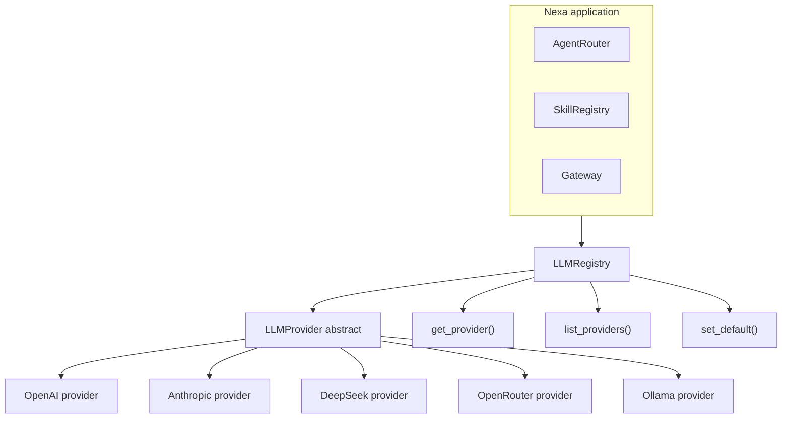

# Phase 11 — Multi-provider LLM (spec)

**Status:** Planning / specification (not fully implemented as described below).  
**Related:** [ARCHITECTURE.md](ARCHITECTURE.md) (current provider gateway and import boundaries), [ROADMAP.md](ROADMAP.md).

---

## Decision

| Priority | Phase | Focus |
| -------- | ----- | ----- |
| **First** | **Phase 11** | Multi-provider LLM — abstract provider layer, DeepSeek, Ollama, OpenRouter, env-based switching |
| **Second** | **Phase 6** | Platform / ecosystem — pluggable skills (over multi-channel expansion first) |

**Reasoning (accepted):** An abstract LLM layer is **foundational**. It unlocks:

- **DeepSeek** (OpenAI-compatible API) without hardcoding one vendor
- **Ollama** for local-first / privacy-preserving runs
- **Provider switching** via environment variables, not code edits
- **Fallbacks** when a primary provider errors or rate-limits

**Second priority:** Phase 6 (skills) over Phase 7 (channels) to build the **OpenClaw-style** extensibility story.

---

## Architecture

### Text diagram (source of truth for layout)

```text
┌─────────────────────────────────────────────────────────────┐
│                    Nexa Application                          │
├─────────────────────────────────────────────────────────────┤
│  AgentRouter  │  SkillRegistry  │  Gateway  │  ...          │
└───────────────────────────┬─────────────────────────────────┘
                            │
                            ▼
┌─────────────────────────────────────────────────────────────┐
│                    LLMRegistry                               │
│  - get_provider() → LLMProvider                             │
│  - list_providers() → [ProviderInfo]                      │
│  - set_default(provider_name)                              │
└───────────────────────────┬─────────────────────────────────┘
                            │
                            ▼
┌─────────────────────────────────────────────────────────────┐
│                    LLMProvider (ABC)                         │
├─────────────────────────────────────────────────────────────┤
│  + complete(messages, tools, temperature) → str              │
│  + complete_streaming() → AsyncIterator                      │
│  + get_model_info() → ModelInfo                              │
└───────────────────────────┬─────────────────────────────────┘
         ┌──────────────────┼──────────────────┐
         ▼                  ▼                  ▼
┌─────────────┐    ┌─────────────┐    ┌─────────────┐
│ OpenAI      │    │ Anthropic   │    │ DeepSeek    │
│ Provider    │    │ Provider    │    │ Provider    │
├─────────────┤    ├─────────────┤    ├─────────────┤
│ GPT-4o      │    │ Claude 3.5  │    │ DeepSeek-V3 │
│ GPT-4       │    │ Claude 3    │    │ DeepSeek-R1 │
│ GPT-3.5     │    │             │    │             │
└─────────────┘    └─────────────┘    └─────────────┘
         │                  │                  │
         └──────────────────┼──────────────────┘
                            ▼
                  ┌─────────────────┐
                  │    Ollama       │
                  │    Provider     │
                  ├─────────────────┤
                  │ Llama 3         │
                  │ Mistral         │
                  │ Phi-3           │
                  │ Local models    │
                  └─────────────────┘
```

### Mermaid (renders on GitHub / many viewers)



---

## Relationship to the current codebase

Nexa already centralizes vendor calls under **`app/services/providers/`** and **`call_provider` / `ProviderRequest`** (see [ARCHITECTURE.md](ARCHITECTURE.md)). Phase 11 work should **extend or align** with that layer rather than introduce a parallel, unconstrained `import openai` path. This document’s `app/llm/` layout is a **target shape**; the merge plan may map `LLMProvider` to the existing gateway so import-linter and privacy gates stay intact.

---

## Objectives

- Abstract **`LLMProvider`** with `complete`, streaming hook, `get_model_info`, and **tool/function-calling** on providers that support it.
- Implementations: **OpenAI**, **Anthropic**, **DeepSeek** (OpenAI-compatible), **Ollama**, **OpenRouter**.
- Configuration via **`.env`**: e.g. `NEXA_LLM_PROVIDER`, `NEXA_LLM_API_KEY`, `NEXA_LLM_MODEL`, `NEXA_LLM_BASE_URL`, fallbacks, temperature, max tokens.
- **Optional (Phase 11.5):** first-class streaming in the product path.
- **Fallback chain** if the primary provider fails.
- **Tests** with mocked HTTP/SDK per provider.
- **Docs** and **`.env.example`** updates (see [env-vars rules](../.cursor/rules/env-vars-sync-dotenv.mdc) in-repo).

---

## Success criteria (checklist)

- [ ] `LLMProvider` base + `LLMRegistry` (or equivalent integrated with the provider gateway)
- [ ] OpenAI, Anthropic, DeepSeek, Ollama, OpenRouter coverage as specified
- [ ] Env-driven default + fallbacks
- [ ] Tool calling where the backend supports it
- [ ] Mocked unit tests per provider
- [ ] User-facing doc + example env

---

## Planned deliverables (file-level)

| Area | Files / notes |
| ---- | -------------- |
| Core | `app/llm/base.py`, `app/llm/registry.py` (or fold into `app/services/providers/`) |
| Providers | `app/llm/providers/openai.py`, `anthropic.py`, `deepseek.py`, `ollama.py`, `openrouter.py` |
| Bootstrap | `app/llm/__init__.py` — register providers from settings |
| Config | `app/core/config.py` — `NEXA_LLM_*` and provider-specific keys |
| Examples | `.env.example` — documented blocks for each provider |
| Tests | `tests/test_llm_providers.py` (and integration with existing provider tests as needed) |
| Docs | This file + operational “how to set DeepSeek/Ollama” in [SETUP.md](SETUP.md) when implemented |

---

## Environment variables (planned)

See `.env.example` when implemented. Illustrative set:

- `NEXA_LLM_PROVIDER` — e.g. `openai`, `anthropic`, `deepseek`, `ollama`, `openrouter`
- `NEXA_LLM_MODEL`, `NEXA_LLM_API_KEY`, `NEXA_LLM_BASE_URL`
- `NEXA_LLM_FALLBACK_PROVIDERS` — comma-separated order
- `NEXA_LLM_TEMPERATURE`, `NEXA_LLM_MAX_TOKENS`
- Provider-specific overrides: `OPENAI_*`, `ANTHROPIC_*`, `DEEPSEEK_*`, `OLLAMA_*`, etc.

---

## Verification (after implementation)

```bash
pytest tests/test_llm_providers.py -v
```

---

## Next step

Reply in the project tracker or a PR with one of:

- **“implement Phase 11”** — ship this spec against the current provider gateway.
- **“Phase 11 + Phase 6”** — combine with the skills system track.
- **“modify spec”** — adjust this document before coding.

*End of Phase 11 planning doc.*
