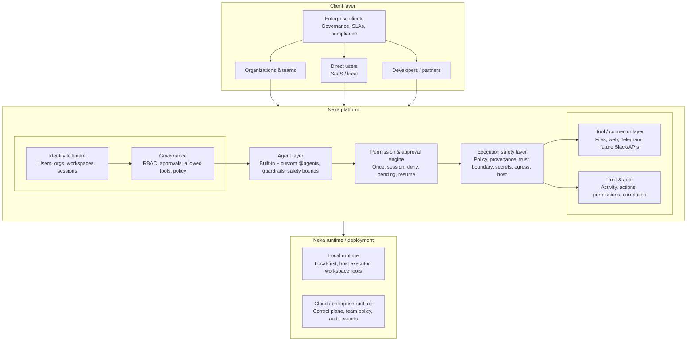
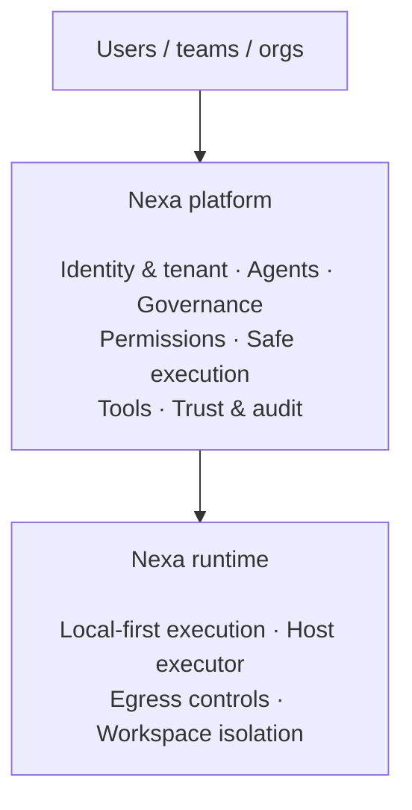

# Nexa — Enterprise / SaaS / Developer Platform (Visual Architecture)

Single-page, **diagram-first** view of Nexa as a governed agent platform. For **how the repo is built today** (modules, folders, flows), see [ARCHITECTURE.md](ARCHITECTURE.md).

---

## Full platform diagram

```txt
                    ┌────────────────────────────────────┐
                    │            ENTERPRISE CLIENTS       │
                    │  (Governance, SLAs, Compliance)     │
                    └──────────────────┬─────────────────┘
                                       │
          ┌────────────────────────────┼────────────────────────────┐
          │                            │                            │
          ▼                            ▼                            ▼

   ┌────────────────┐          ┌────────────────┐          ┌──────────────────┐
   │  ORGANIZATIONS │          │  DIRECT USERS  │          │ DEVELOPERS /     │
   │  & TEAMS       │          │  (SaaS / Local)│          │ PARTNERS         │
   └───────┬────────┘          └───────┬────────┘          └────────┬─────────┘
           │                           │                            │
           │                           │                            │
           ▼                           ▼                            ▼

┌──────────────────────────────────────────────────────────────────────────────┐
│                              NEXA PLATFORM                                   │
│                                                                              │
│  ┌──────────────────────────┐    ┌────────────────────────────────────────┐  │
│  │ Identity & Tenant Layer  │    │ Governance Layer                       │  │
│  │ - Users                  │    │ - Roles / RBAC                         │  │
│  │ - Organizations          │    │ - Approval rules                       │  │
│  │ - Workspaces             │    │ - Allowed tools/apps                   │  │
│  │ - Sessions               │    │ - Policy enforcement                   │  │
│  └──────────────────────────┘    └────────────────────────────────────────┘  │
│                                                                              │
│  ┌────────────────────────────────────────────────────────────────────────┐  │
│  │ Agent Layer                                                           │  │
│  │ - Built-in agents (Dev, QA, Ops, Research, Strategy, Marketing)        │  │
│  │ - Custom agents with @handles                                         │  │
│  │ - Regulated-domain guardrails                                         │  │
│  │ - Agent instructions + safety boundaries                              │  │
│  └────────────────────────────────────────────────────────────────────────┘  │
│                                                                              │
│  ┌────────────────────────────────────────────────────────────────────────┐  │
│  │ Permission & Approval Engine                                          │  │
│  │ - Allow once                                                          │  │
│  │ - Allow for session                                                   │  │
│  │ - Deny                                                                │  │
│  │ - Pending permission requests                                         │  │
│  │ - Resume execution after approval                                     │  │
│  └────────────────────────────────────────────────────────────────────────┘  │
│                                                                              │
│  ┌────────────────────────────────────────────────────────────────────────┐  │
│  │ Execution Safety Layer                                                │  │
│  │ - Non-compactable safety policy                                       │  │
│  │ - Provenance / instruction_source                                     │  │
│  │ - Trusted vs untrusted content boundary                               │  │
│  │ - Secret detection                                                    │  │
│  │ - Egress / external send gate                                         │  │
│  │ - Host executor guardrails                                            │  │
│  └────────────────────────────────────────────────────────────────────────┘  │
│                                                                              │
│  ┌──────────────────────────┐    ┌────────────────────────────────────────┐  │
│  │ Tool / Connector Layer   │    │ Trust & Audit Layer                    │  │
│  │ - Local files            │    │ - Trust Activity timeline              │  │
│  │ - Web access             │    │ - Allowed / blocked actions            │  │
│  │ - Telegram               │    │ - Permission usage                     │  │
│  │ - Future Slack / GitHub  │    │ - External send history                │  │
│  │ - Future APIs            │    │ - Workflow / run correlation           │  │
│  └──────────────────────────┘    └────────────────────────────────────────┘  │
│                                                                              │
└──────────────────────────────────────────────────────────────────────────────┘
                                       │
                                       ▼

┌──────────────────────────────────────────────────────────────────────────────┐
│                         NEXA RUNTIME / DEPLOYMENT                            │
│                                                                              │
│  ┌──────────────────────────┐    ┌────────────────────────────────────────┐  │
│  │ Local Runtime            │    │ Cloud / Enterprise Runtime             │  │
│  │ - Local-first execution  │    │ - Multi-tenant control plane           │  │
│  │ - Host executor          │    │ - Team policies                        │  │
│  │ - Workspace roots        │    │ - Admin dashboard                      │  │
│  │ - Low blast radius       │    │ - Audit exports                        │  │
│  └──────────────────────────┘    └────────────────────────────────────────┘  │
│                                                                              │
└──────────────────────────────────────────────────────────────────────────────┘
```

---

## Same model in Mermaid (renders in GitHub, many IDEs)



---

## Short version (ASCII)

```txt
┌───────────────────────────────┐
│        USERS / TEAMS / ORGS    │
└───────────────┬───────────────┘
                │
                ▼
┌───────────────────────────────┐
│          NEXA PLATFORM         │
│                               │
│  Identity + Tenant             │
│  Custom Agents                 │
│  Governance                    │
│  Permissions / Approvals       │
│  Safe Execution                │
│  Tools / Connectors            │
│  Trust + Audit                 │
└───────────────┬───────────────┘
                │
                ▼
┌───────────────────────────────┐
│        NEXA RUNTIME            │
│                               │
│  Local-first execution         │
│  Host executor                 │
│  Egress controls               │
│  Workspace isolation           │
└───────────────────────────────┘
```

---

## Short version (Mermaid)



---

## Nexa enterprise architecture layers

### 1. Client layer

**Includes:** Enterprise clients; organizations / teams; direct users; developers / partners.

**Purpose**

- Different user types enter through the same governed platform.
- Activity is shaped by permissions, roles, and audit—not by channel alone.

---

### 2. Identity & tenant layer

**Includes:** Users; organizations; workspaces; sessions; roles (as they map into the product).

**Purpose**

- Know who is acting and in which workspace.
- Lay the groundwork for enterprise controls (tenancy, isolation, admin models).

---

### 3. Agent layer

**Includes:** Built-in agents; custom agents; `@` handles; regulated-domain agents; agent instructions; safety boundaries.

**Purpose**

- Users can specialize behavior (custom agents) while built-ins stay default templates.
- Custom agents remain **governed**—permissions and policy apply, not a separate “shadow” system.

---

### 4. Governance layer

**Includes:** Roles; allowed tools; approval rules; admin policies; risk tiers.

**Purpose**

- Define what agents may do and what must be elevated.
- Keep behavior **enterprise-controlled**, not only model-controlled.

---

### 5. Permission & approval engine

**Includes:** Permission required; allow once; allow for session; deny; pending requests; resume after approval.

**Purpose**

- Avoid silent filesystem, tool, or network access.
- Keep the human in the loop where it matters; make approvals **auditable**.

---

### 6. Execution safety layer

**Includes:** Safety policy; instruction provenance; trusted vs untrusted content boundary; secret detection; egress / external send gate; host executor controls.

**Purpose**

- Reduce prompt-injection and untrusted-content risk.
- Block accidental secret egress; keep execution **structural** (policy and gates), not purely prompt-driven.

---

### 7. Tool / connector layer

**Includes:** Local files; web access; Telegram; future Slack, GitHub, Jira, APIs.

**Purpose**

- Tools are **not** a free-for-all: each path is subject to governance and approvals.
- New connectors plug in under the same permission and audit model.

---

### 8. Trust & audit layer

**Includes:** Trust Activity; allowed / blocked actions; permission use; external sends; correlation IDs.

**Purpose**

- Users see what happened; admins can review; enterprise teams can **audit** behavior over time.

---

### 9. Runtime / deployment layer

**Includes:** Local runtime; cloud runtime; enterprise runtime (conceptual).

**Purpose**

- **Local-first** execution where it improves safety and blast radius.
- Room for a cloud / enterprise **control plane** (policies, admin, exports) alongside self-hosted and managed models.

---

## What makes Nexa different

**Many agent tools optimize for:** more autonomy, more integrations, more actions.

**Nexa optimizes for:**

- **Who** can act
- **What** can be touched
- **What** requires approval
- **What** happened afterward

---

## One-line architecture summary

Nexa is a **governed agent platform** where custom agents, tools, permissions, approvals, execution, and audit all flow through one **safety-first runtime**.

---

## Product positioning

- **Nexa = governance layer for AI agents that touch real systems.**

Or, in one line:

- **Nexa lets teams run AI agents with permission, approval, and audit built in.**

---

## See also

- [ARCHITECTURE.md](ARCHITECTURE.md) — codebase and system structure (Arcturus / implementation)
- [ROADMAP.md](ROADMAP.md) — direction and phases
- [WORKSPACE_AND_PERMISSIONS.md](WORKSPACE_AND_PERMISSIONS.md) — workspace and permission concepts in this repo
